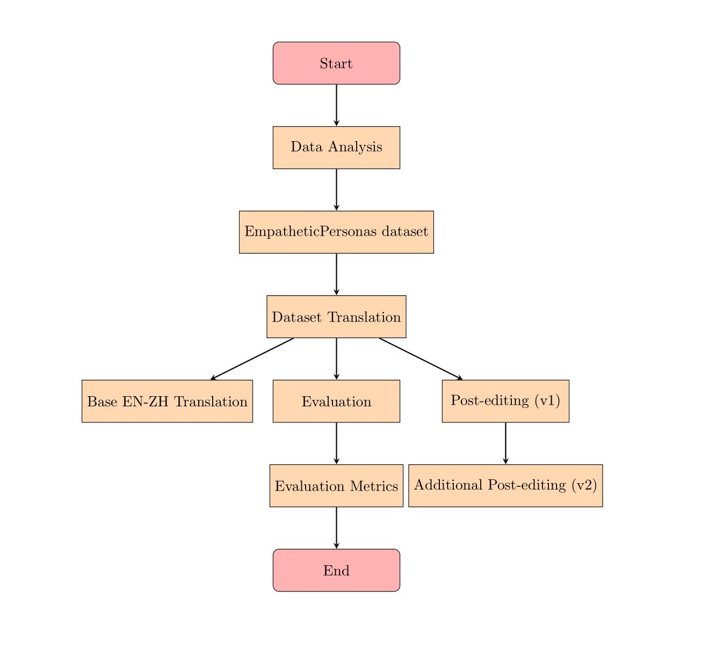
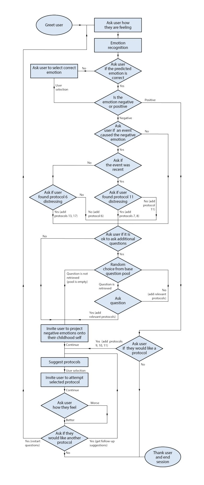

# Comprehensive Summaries of Relevant Papers with flowcharts

## Introduction

Mental health chatbots are conversational agents that can provide psychotherapy and emotional support using natural language interactions. Recent advancements in natural language processing and neural network modeling have enabled significant progress in this field. However, most chatbots are limited to English, while mental health needs are universal across different languages and cultures. This summary will examine how an existing English self-attachment therapy chatbot was adapted to Mandarin Chinese through machine translation, transfer learning, and model compression techniques.

## Background

The self-attachment therapy (SAT) chatbot aims to guide users in practicing protocols from SAT, a form of psychotherapy focused on strengthening the relationship between one's adult self and inner child self. SAT has shown promise in improving emotional regulation in pilot studies. The chatbot was developed to make SAT more accessible through a conversational digital coach.

Previous versions of the SAT chatbot used rule-based conversation modeling, which limits flexibility and engagement. The recent research papers present more robust versions that incorporate deep learning for emotion recognition and empathetic response generation.

## Dataset Creation and Annotation

A key component in developing the advanced SAT chatbot was curating an appropriate training dataset. The EmpatheticPersonas dataset was crowdsourced using Amazon Mechanical Turk. It contains:

- 1,181 textual expressions of emotions like sadness, anger, fear, and joy. These enable training an emotion classifier.
- 2,143 empathetic rewrites of 45 base utterances, where crowd workers rephrased the utterances to be more empathetic given a particular emotion. This provides data for training an empathy classifier and generating empathetic responses.
- Discrete empathy ratings on a scale of 0-2 for 1,100 of the rewritten utterances. Higher values indicate more empathetic phrasing.

The emotion expressions and empathetic rewrites were collected by prompting crowd workers to imagine they were experiencing a given emotion. While not genuine, this provides plausible data.

To adapt the chatbot to Mandarin, the English dataset was machine translated into Mandarin and then manually post-edited by native speakers. This improved translation quality over raw output, as measured by fluency metrics like SLOR, PRISM-SRC, and perplexity. Post-editing also allowed screening for any translation errors that could negatively impact user safety.

### Translation Process Summary

The translation process for converting English to Mandarin involved the following steps:

1. **Data Analysis:** The process began with an analysis of the EmpatheticPersonas dataset, which included expressions of emotion and empathetic rewrites.
2. **Dataset Translation:** To streamline the translation process, publicly available machine translation tools were employed, followed by post-editing steps (v1 and v2) to enhance translation quality.
3. **Evaluation Metrics:** The quality of translations was assessed using reference-free sentence fluency metrics, demonstrating improvements with post-editing.

## Emotion Recognition

Recognizing the user's emotional state is essential for the SAT chatbot to contextualize its responses. A RoBERTa model was trained on the emotion expressions in EmpatheticPersonas to classify text into four categories: sadness, anger, fear, or joy.

User Input (Emotional Description): The chatbot begins by prompting the user to describe their emotional state at the start of each conversation.

**Pretrained RoBERTa Model:** A RoBERTa language model, initially pretrained on an existing English emotion dataset, serves as the foundation. This model is used for the subsequent fine-tuning steps.

**Fine-tuning on Affective Dataset:** The pretrained RoBERTa model is fine-tuned on Saravia et al.'s affective dataset, adapting it to emotion recognition.

**Fine-tuning on Expressions of Emotion:** Further fine-tuning is performed using the expressions of emotion from the EmpatheticPersonas dataset, which includes sadness, anger, fear, and joy. This fine-tuning process enhances the model's ability to recognize emotions.

**Model Evaluation:** The performance of the fine-tuned model is assessed using evaluation metrics. It achieves an impressive 94.96% accuracy and significantly outperforms a baseline keyword-based classifier implemented in the previous version of the chatbot.

.jpg)

The model was pre-trained on an existing English emotion dataset, then fine-tuned on the SAT data. This achieved 94.96% accuracy on the SAT test set, significantly improving over a baseline keyword-based classifier.

For Mandarin, an XLM-Roberta model was trained. It was first fine-tuned on a native Mandarin emotion dataset, then the translated SAT data. Despite limited in-domain Mandarin data, it achieved over 90% accuracy on Mandarin test sets.

To optimize the model for production deployment, knowledge distillation was used to compress it into a smaller model with faster inference times and no significant performance loss (~85% accuracy on English test set).

## Empathetic Response Generation

The chatbot aims to produce empathetic responses using the rewritten utterances from EmpatheticPersonas. Each rewrite was split into individual sentences. These were recombined to form a large set of candidate responses.

To generate empathetic responses it follows the following steps:

**Candidate Response Generation:** Rewritten utterances from EmpatheticPersonas are used as a source for candidate responses. These rewritten utterances are broken down into individual sentences and recombined, creating a pool of potential responses.

**Scoring Candidates:** When the chatbot needs to respond, it evaluates each candidate response based on three criteria:

- **Empathy:** A T5 classifier, fine-tuned using empathy annotations, is used to assess the level of empathy conveyed by each candidate response.
- **Fluency:** Fluency is determined by calculating perplexity using a language model. Repetitive responses are penalized to ensure coherence.
- **Novelty:** The chatbot considers the similarity of a candidate response to previous chatbot responses, aiming for diversity.

**Response Selection:** The chatbot selects the response that scores highest across these criteria. This approach allows the chatbot to respond empathetically while maintaining coherence and ensuring a variety of responses.

For Mandarin, Chinese GPT-2 was trained with reinforcement learning to perform empathetic rewriting. Supervised fine-tuning was also explored. Responses were manually screened for any inappropriate content.

.jpg)

## Conversation Flow and User Experience

The chatbot's conversation flow is structured using a flowchart designed to optimize the practice of SAT (Self-Attachment Technique). When a user logs into the application, they are prompted to choose a persona from among five options: Kai, Robert, Gabrielle, Arman, and Olivia. Each persona corresponds to a specific subset of the (augmented) dataset that is loaded into the backend.

The conversation between the user and the chatbot allows for a combination of open-text and multiple-choice inputs, and it is guided by the flowchart. Deep-learning techniques are applied at various nodes in the flowchart for tasks such as emotion recognition and utterance retrieval.

All five personas navigate the same flowchart during conversations, but each persona has access to a specific set of utterances. Additionally, the user's emotional state, once identified, is saved as a variable and used to select relevant subsets of utterances from the dataset.

The primary objective of the chatbot is to recommend the most appropriate SAT protocols. As users progress through the conversation, a list of protocol suggestions is generated. The content of this list and the timing of its disclosure depend on the user's responses and engagement during the conversation.

To enhance user engagement, users can select a persona for the chatbot, each accompanied by a unique avatar. The available personas include Kai, who uses the full dataset, as well as personas representing younger and older individuals, both male and female:

- Kai - uses the full dataset
- Younger female (Olivia)
- Younger male (Arman)
- Older female (Gabrielle)
- Older male (Robert)

The web interface of the chatbot displays protocol instructions in both English and Mandarin, catering to a diverse user base and ensuring a personalized and informative user experience.

# Evaluation

Both versions of the SAT chatbot underwent non-clinical human trials over 5 days with post-study surveys.

For Mandarin, 42 bilingual participants tested the chatbot. Results showed comparable performance to the English version in perceived empathy, engagement, and usefulness. The compressed emotion classifier actually received higher ratings than the English version.

Qualitative feedback highlighted the lack of SAT knowledge amongst participants as a limitation, and suggested recruiting expert clinicians for future trials. Participants also desired a wider range of emotions and more nuanced feedback options.

In the English study with 16 participants, the chatbot showed significant improvements over a purely rule-based version. 63% agreed the emotion recognition was accurate, and 75-88% found the chatbot empathetic, engaging, and useful.

## Conclusion

Recent advancements in deep learning and NLP have enabled sophisticated mental health chatbots with emotion awareness and empathetic dialogue. While most systems are English-only, techniques like machine translation and transfer learning show promise in adapting them to new languages like Mandarin. However, thorough testing and ensuring user safety remain critical when applying AI to such a sensitive domain. Further research into multilingual and multicultural mental healthcare chatbots will continue advancing access to support worldwide.
